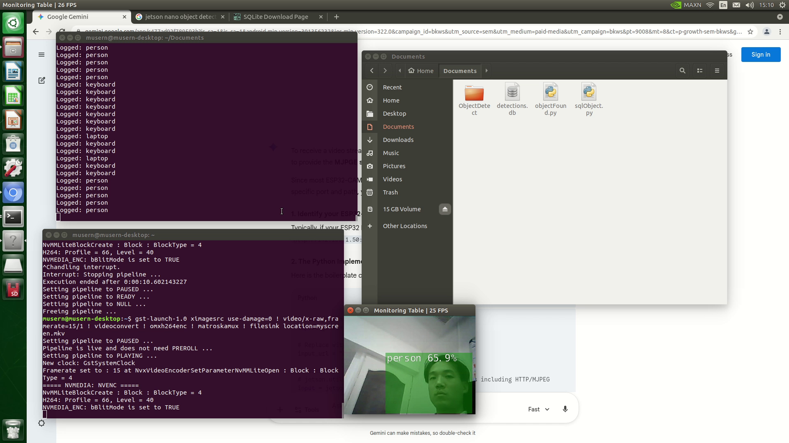
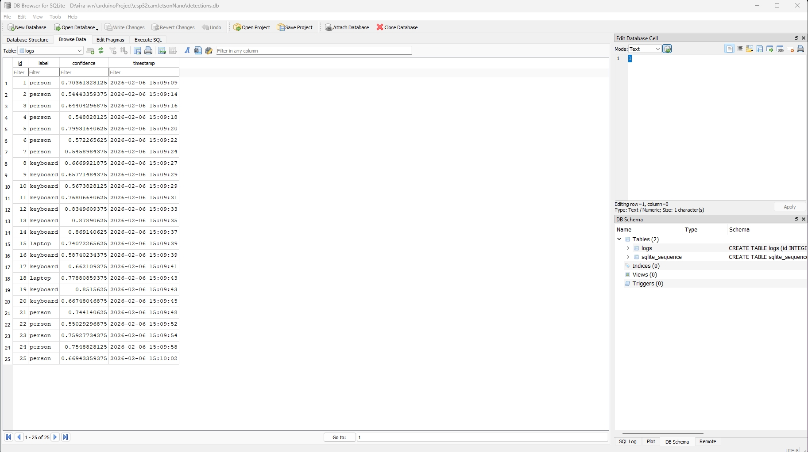

Smart Space Monitoring & Data Analytics System
AI-Powered Vision System for Facility Management
https://youtu.be/NTQSLex_IPo

  

📌 Project Overview
พัฒนาระบบตรวจจับและวิเคราะห์ความหนาแน่นการใช้งานพื้นที่แบบ Real-time โดยใช้เทคโนโลยี AI เพื่อเปลี่ยนข้อมูลภาพจากกล้องวงจรปิดให้เป็นข้อมูลเชิงสถิติ (Structured Data) สำหรับนำไปใช้ในการบริหารจัดการทรัพยากรอย่างมีประสิทธิภาพ

🛠️ เทคโนโลยีที่เลือกใช้ 

Hardware: * NVIDIA Jetson Nano: ประมวลผล AI Inference (Computing)

ESP32-CAM: อุปกรณ์รับภาพต้นทางผ่านโปรโตคอล HTTP Stream

Software & AI:

Python: ภาษาหลักในการพัฒนาระบบ

Jetson Inference (SSD-Mobilenet-v2): โครงข่ายประสาทเทียมสำหรับการตรวจจับวัตถุ (Object Detection)

OpenCV: จัดการ Stream ข้อมูลภาพจากกล้อง Network Camera

Database:

SQLite: จัดเก็บข้อมูลการตรวจจับ (Logging) เพื่อใช้ในการวิเคราะห์ย้อนหลัง

  

⚙️ คุณสมบัติเด่นของระบบ (Key Features)
Autonomous Monitoring: ตรวจจับบุคคลและอุปกรณ์สำนักงาน (Person, Keyboard, Laptop) ได้แบบอัตโนมัติ (สามารถเพิ่มอุปกรณ์อื่นๆได้อีก)

Data Persistence: แปลงผลการตรวจจับจาก AI ให้เป็นชุดข้อมูลในรูปแบบ Relational Database (SQL) เพื่อความสะดวกในการทำ Data Analytics

Fault Tolerance: มีระบบ Reconnection Logic เมื่อสัญญาณภาพจากกล้องขัดข้อง เพื่อให้ระบบทำงานได้ต่อเนื่อง 

💻 โครงสร้างของข้อมูล (Data Schema)
ระบบจัดเก็บข้อมูลลงใน detections.db โดยมีโครงสร้างดังนี้:

id: ลำดับรายการ

label: ประเภทวัตถุที่ตรวจพบ

confidence: ค่าความเชื่อมั่นของ AI

timestamp: วันและเวลาที่ตรวจพบ (Local Time)
